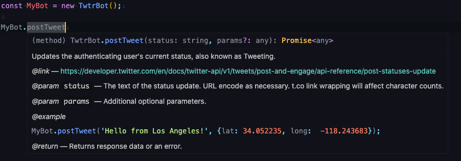

# TwitterBot

TwitterBot is a simple Node module that allows developers to build a Twitter bot via the Twitter API in conjunction with the [twit module](https://github.com/ttezel/twit). Using an object-oriented approach, TwitterBot makes calling functions more intuitive, resulting in cleaner and easier to understand code.

TwitterBot arose from a personal need to encapsulate popular actions such as posting a status, retweeting a status, and searching for statuses, into a set of methods for better code maintainability and efficiency.

## Instillation

`npm i twitterbot --save`

## Usage

Be sure to first create a new bot (aka application) over at <https://developer.twitter.com/>. This package can and *should* be used in conjunction to <https://github.com/ttezel/twit>.

### Features

JSDoc highlighting with link to corresponding Twitter API reference:


### Example Snippet

```JavaScript
const TwitterBot  = require('./TwitterBot');
const MyBot = new TwitterBot(CONSUMER_KEY CONSUMER_SECRET, ACCESS_TOKEN, ACCESS_SECRET);

MyBot.postTweet("Hello world!");  // Post a Tweet

let params = {
  attachment_url: 'https://github.com/sirandluke',
}
MyBot.postTweet("Check out my Github!", params);

MyBot.searchTweets("oat milk latte").then(async (data) => {
  let tweets = data.statuses;
  for await (let tweet of tweets) {
    let tweet_id = tweet.id;
    MyBot.postRetweet(tweet_id);
  }
});

MyBot.twit.stream('statuses/filter', { track: 'oolong milk tea' });
```

### Snippet Breakdown

Import the module:

```JavaScript
const TwitterBot  = require('./TwitterBot');  // Import module
```

Initialize your bot object:

```JavaScript
const MyBot = new TwitterBot(CONSUMER_KEY CONSUMER_SECRET, ACCESS_TOKEN, ACCESS_SECRET);  // Initialize bot.
```

You can find find all your credentials over at <https://developer.twitter.com/>, under the `Projects & Apps` tab.

Posting your first Tweet (aka status):

```JavaScript
const MyBot = new TwitterBot(CONSUMER_KEY CONSUMER_SECRET, ACCESS_TOKEN, ACCESS_SECRET);

MyBot.postTweet("Hello world!");  // Post a Tweet
```

Posting a Tweet passing optional parameters:

```JavaScript
let params = {
  attachment_url: 'https://github.com/sirandluke',
}
MyBot.postTweet("Check out my Github!", params);
```

Searching tweets based on a query and retweeting those tweets:

```JavaScript
MyBot.searchTweets("oat milk latte").then(async (data) => {
  let tweets = data.statuses;
  for await (let tweet of tweets) {
    let tweet_id = tweet.id;
    MyBot.postRetweet(tweet_id);
  }
});
```

Accessing the twit object to perform uncovered functions in the module:

```JavaScript
MyBot.twit.stream('statuses/filter', { track: 'oolong milk tea' })
```

## Contributing

Feel free to make any changes and submit a pull request!
